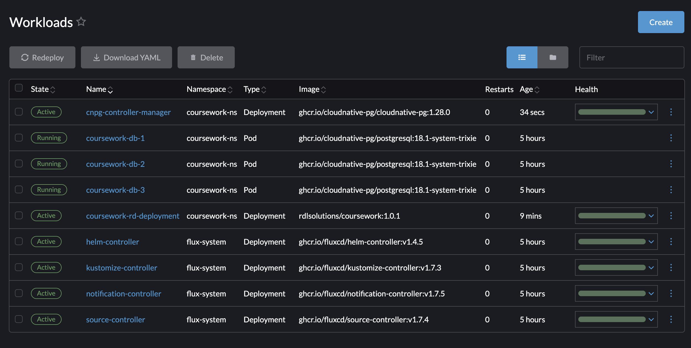
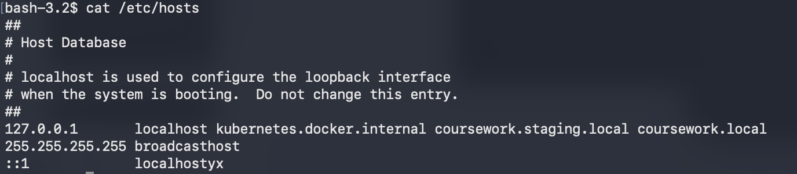
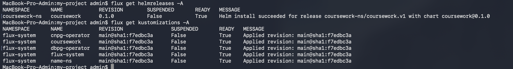
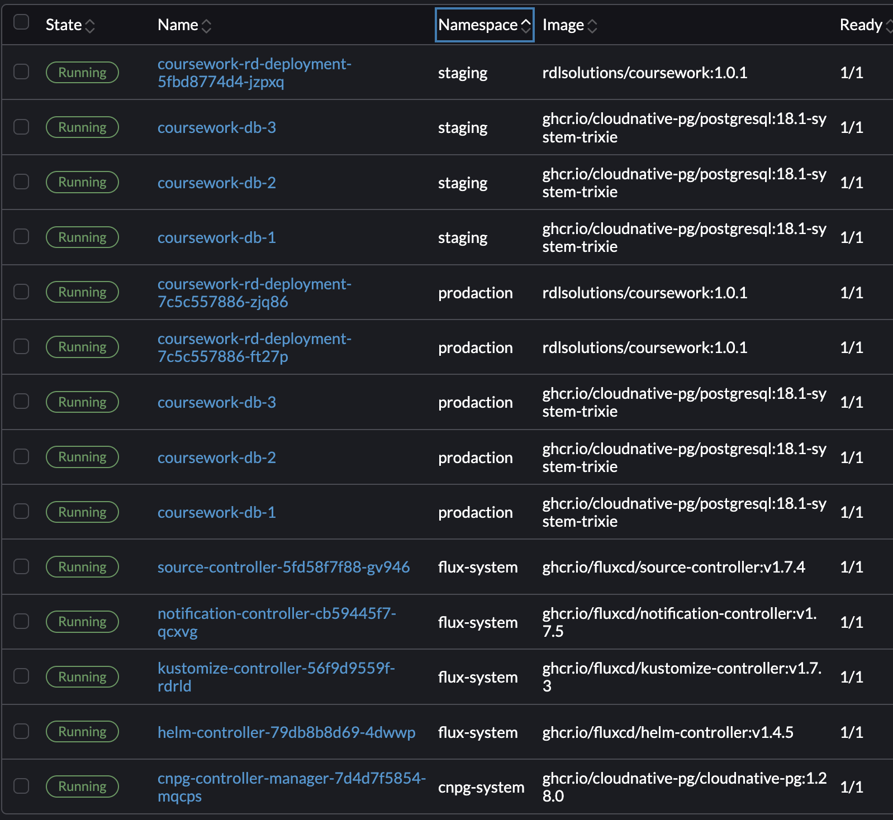
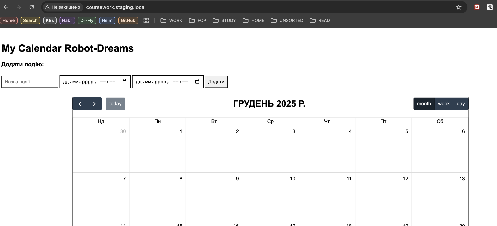
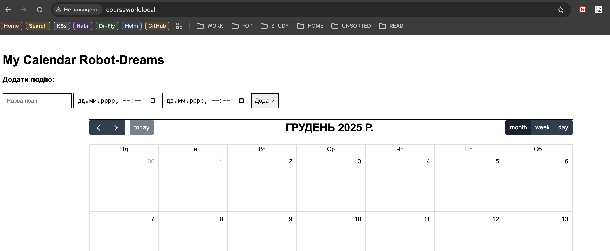

# Coursework. Robot-Dreams

## coursework-rd. Introdution

Для курсового проекту був створений застосунок у вигляді веб-календаря, який зберігає події в БД Postgres (стан Stateful).


В GitHub був створений публічний репозиторій [https://github.com/rdlsolutions/coursework-rd](https://github.com/rdlsolutions/coursework-rd)

### Етап 1. Containerization


Застосунок був збілджений за допомогою Dockerfil з multistage та завантажений до Docker Hub репозиторію [https://hub.docker.com/repository/docker/rdlsolutions/coursework/general](https://hub.docker.com/repository/docker/rdlsolutions/coursework/general)


Також одразу до завдання був доданий image Postgres:16 для тестування застосунку та побудови Docker-compose.yaml


### Етап 2. Helm-chart

#### Flux CD

Небхідно встановити та налаштувати Helm для застосунку.

`helm create coursework`

Налаштовуємо змінні для:

- deployment.yaml
- service.yaml
- ingress.yaml

```sh
  flux bootstrap github --owner=rdlsolutions  --repository=coursework-rd  --branch=main  --path=clusters/local
```

### Етап 3. Додаємо БД та оператори

Для застосунку необхідна для роботи БД Postgres, створюємо її через flux kustomize, додаючи до кластеру файл postgres.yaml kind: Cluster від postgresql.cnpg.io/v1 та додаємо оператор БД CloudNativePG. Паралельно додаємо kustomize ресурси для застосунку.



Звʼязуємо до кучі додаток та кластер Postgres. Не забуваємо в /etc/hosts прописати отчення для Staging та Production



### Етап 4. Конфігурація: Production-ready для БД та додатку

Для створення архітектур prodaction та staging потрібно рознести файли конфігурації проєкту на декілька директорій:

```sh
├── apps
│   ├── base
│   ├── production
│   └── staging
├── infrastructure
│   ├── configs
│   └── controllers
└── clusters
  ├── production
  └── staging
```



```sh
bash-3.2$  flux bootstrap github --owner=rdlsolutions  --repository=coursework-rd  --branch=main  --path=clusters/local
► connecting to github.com
► cloning branch "main" from Git repository "https://github.com/rdlsolutions/coursework-rd.git"
✔ cloned repository
► generating component manifests
✔ generated component manifests
✔ component manifests are up to date
► installing components in "flux-system" namespace
✔ installed components
✔ reconciled components
► determining if source secret "flux-system/flux-system" exists
► generating source secret
✔ public key: ecdsa-sha2-nistp384 AAAAE2VjZHNhLXNoYTItbmlzdHAzODQAAAAIbmlzdHAzODQAAABhBIba5m8yw/bEHmjoG8YQGZJA+IdNRzIO/WqfmR3AfPsFKlvWaR30d/rXcMbnTRQRNIzhjBD6KTsBIYalVBoMgm+z8xSzZxVPyjPqiKjYZYUofk4rnCwp3bJTkr01H8JkLw==
✔ configured deploy key "flux-system-main-flux-system-./clusters/local" for "https://github.com/rdlsolutions/coursework-rd"
► applying source secret "flux-system/flux-system"
✔ reconciled source secret
► generating sync manifests
✔ generated sync manifests
✔ sync manifests are up to date
► applying sync manifests
✔ reconciled sync configuration
◎ waiting for GitRepository "flux-system/flux-system" to be reconciled
✔ GitRepository reconciled successfully
◎ waiting for Kustomization "flux-system/flux-system" to be reconciled
✔ Kustomization reconciled successfully
► confirming components are healthy
✔ helm-controller: deployment ready
✔ kustomize-controller: deployment ready
✔ notification-controller: deployment ready
✔ source-controller: deployment ready
✔ all components are healthy

```



Різниця між staging та prodaction

```sh
bash-3.2$ kubectl get all -n prodaction
NAME                                            READY   STATUS    RESTARTS      AGE
pod/coursework-db-1                             1/1     Running   0             45m
pod/coursework-db-2                             1/1     Running   0             45m
pod/coursework-db-3                             1/1     Running   0             44m
pod/coursework-rd-deployment-7c5c557886-ft27p   1/1     Running   5 (45m ago)   47m
pod/coursework-rd-deployment-7c5c557886-zjq86   1/1     Running   5 (45m ago)   46m

NAME                       TYPE        CLUSTER-IP     EXTERNAL-IP   PORT(S)    AGE
service/coursework-db-r    ClusterIP   10.43.21.51    <none>        5432/TCP   47m
service/coursework-db-ro   ClusterIP   10.43.34.79    <none>        5432/TCP   47m
service/coursework-db-rw   ClusterIP   10.43.56.164   <none>        5432/TCP   47m
service/coursework-svc     ClusterIP   10.43.223.65   <none>        8080/TCP   47m

NAME                                       READY   UP-TO-DATE   AVAILABLE   AGE
deployment.apps/coursework-rd-deployment   2/2     2            2           47m

NAME                                                  DESIRED   CURRENT   READY   AGE
replicaset.apps/coursework-rd-deployment-7c5c557886   2         2         2       47m

NAME                                                 REFERENCE                             TARGETS       MINPODS   MAXPODS   REPLICAS   AGE
horizontalpodautoscaler.autoscaling/coursework-hpa   Deployment/coursework-rd-deployment   cpu: 0%/80%   2         5         2          47m
-----------------------------------------------------------------------------------
bash-3.2$ kubectl get all -n staging
NAME                                            READY   STATUS    RESTARTS      AGE
pod/coursework-db-1                             1/1     Running   0             45m
pod/coursework-db-2                             1/1     Running   0             45m
pod/coursework-db-3                             1/1     Running   0             44m
pod/coursework-rd-deployment-5fbd8774d4-jzpxq   1/1     Running   5 (45m ago)   47m

NAME                       TYPE        CLUSTER-IP      EXTERNAL-IP   PORT(S)    AGE
service/coursework-db-r    ClusterIP   10.43.102.103   <none>        5432/TCP   47m
service/coursework-db-ro   ClusterIP   10.43.22.178    <none>        5432/TCP   47m
service/coursework-db-rw   ClusterIP   10.43.220.248   <none>        5432/TCP   47m
service/coursework-svc     ClusterIP   10.43.13.34     <none>        8080/TCP   47m

NAME                                       READY   UP-TO-DATE   AVAILABLE   AGE
deployment.apps/coursework-rd-deployment   1/1     1            1           47m

NAME                                                  DESIRED   CURRENT   READY   AGE
replicaset.apps/coursework-rd-deployment-5fbd8774d4   1         1         1       47m
bash-3.2$ 

```

### Staging



### Prodaction




### Final action

Скріншоти команд, що підтверджують роботу:
kubectl get helmreleases -A
kubectl get pods -A (має бути видно поди в обох неймспейсах).
kubectl get ingress -A


