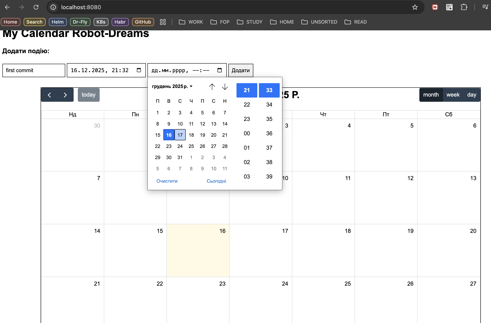
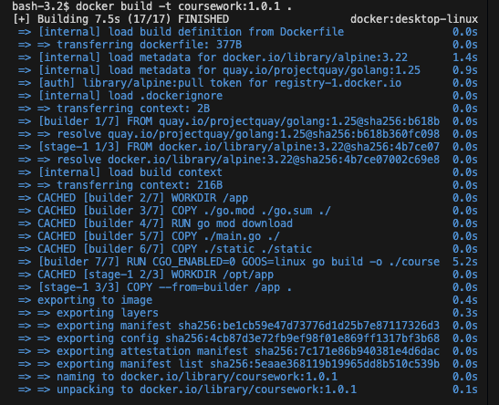
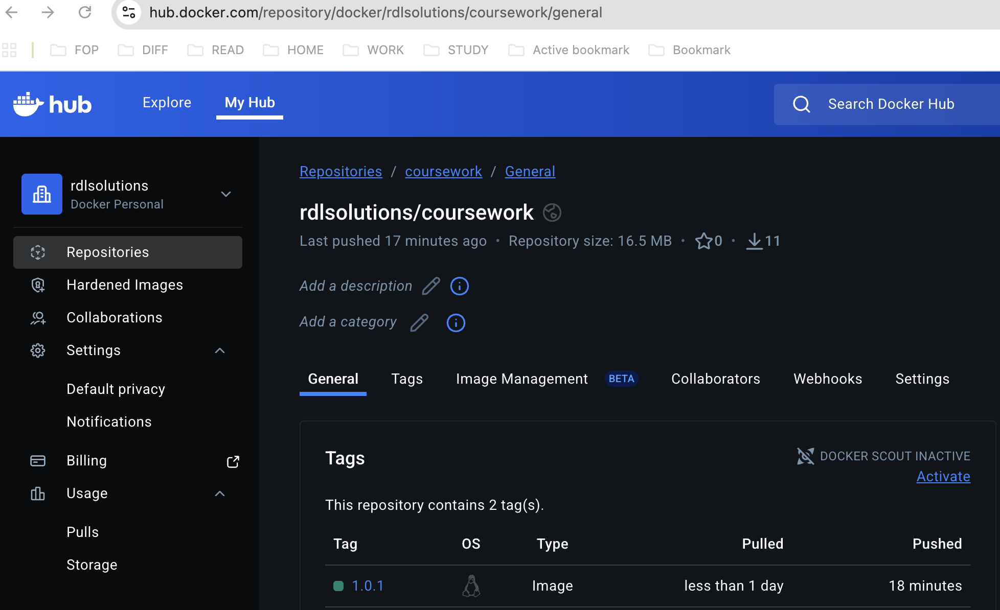

# Coursework. Robot-Dreams

## coursework-rd. Introdution

Для курсового проекту був створений застосунок у вигляді веб-календаря, який зберігає події в БД Postgres (бути Stateful).

В GitHub був створений публічний репозиторій [https://github.com/rdlsolutions/coursework-rd](https://github.com/rdlsolutions/coursework-rd)

### Етап 1. Containerization.

Застосунок був збілджений за допомогою Dockerfil з multistage та завантажений до Docker Hub репозиторію [https://hub.docker.com/repository/docker/rdlsolutions/coursework/general](https://hub.docker.com/repository/docker/rdlsolutions/coursework/general)

ТАкож одразу до завдання був доданий image Postgres:16 для тестування застосунку та побудови Docker-compose.yaml

### Етап 2. Helm-chart

